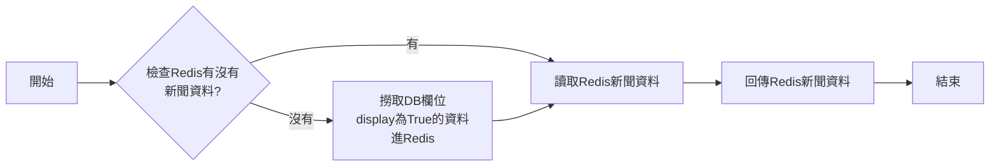
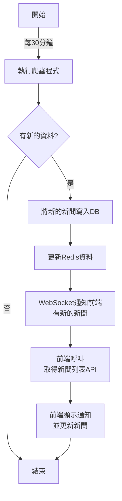

# Unnotech Backend Engineer 徵才小專案

## 目標達成狀況

### 基本要求
- [x] 抓取 http://tw-nba.udn.com/nba/index 中的焦點新聞。
- [x] 使用 [Django](https://www.djangoproject.com/) 設計恰當的 Model，並將所抓取新聞存儲至 DB。
- [x] 使用 [Django REST Framework](http://www.django-rest-framework.org/) 配合 AJAX 實現以下頁面：
	 * 焦點新聞列表
	 * 新聞詳情頁面
- [x] 以 Pull-Request 的方式將代碼提交。
	
### 進階要求
- [x] 實現爬蟲自動定時抓取。
- [x] 使用 Websocket 服務，抓取到新的新聞時立即通知前端頁面。
- [x] 將本 demo 部署到伺服器並可正確運行。
- [x] 所實現新聞列表 API 可承受 100 QPS 的壓力測試。

## 實作說明
* 成品連結: [連結](http://34.122.154.90/)
* 資料來源網站: [UDN NBA新聞網](https://tw-nba.udn.com/nba/index)

## 使用工具說明
### backend:
* 語言、框架: Python, Django
* 資料庫: SQLite
* 排程工具: APScheduler
* Websocket: channels
* 快取工具: redis
### frontend
* 框架:Vue
* UI元件:Vuetify
### 雲端與容器化
* 容器化工具: Docker
* Server: GCP

## 使用流程說明
1. 進入系統時會顯示全部焦點新聞(與[UDN NBA新聞網](https://tw-nba.udn.com/nba/index) 輪播新聞同步，固定10則)
 
2. 點擊新聞後，會顯示新聞詳情內容

3. 系統每30分鐘會去抓取最新的焦點新聞，如果有撈取到新的新聞，會透過WebSocket通知前端頁面，並更新新聞

## 功能說明
> 爬蟲程式抓取到新聞後，會把新聞存入redis，而新聞列表API會直接將redis的資料回傳，以此來減少DB的操作提升效能。
### 新聞列表流程說明
* 取得新聞列表API: [/api/get_focus_news/](http://34.122.154.90:8000/api/get_focus_news/)
* 流程圖

### 爬取新聞流程說明
* 程式路徑: backend/main/crawler.py
* 流程圖

### DB
> 本次僅建立 `news` table作為新聞存取的table

| Column Name  | Data Type    | Constraints                            | Description             |
|--------------|--------------|----------------------------------------|-------------------------|
| id           | integer      | NOT NULL, PRIMARY KEY, AUTOINCREMENT   | 新聞id                  |
| title        | varchar(255) | NOT NULL                               | 新聞標題                |
| content      | text         | NOT NULL                               | 新聞內文(html)          |
| display      | bool         | NOT NULL                               | 是否顯示                |
| published_at | datetime     | NOT NULL                               | 新聞發布時間            |
| created_at   | datetime     | NOT NULL                               | 爬蟲抓取時間            |
| news_href    | varchar(200) | NOT NULL, UNIQUE                       | 新聞的連結              |
| img_href     | varchar(200) | NOT NULL                               | 縮圖連結                |

## QPS測試
利用Apache Benchmark 測試API，總共發送1000個請求，一次發送100個
### 測試結果
 
